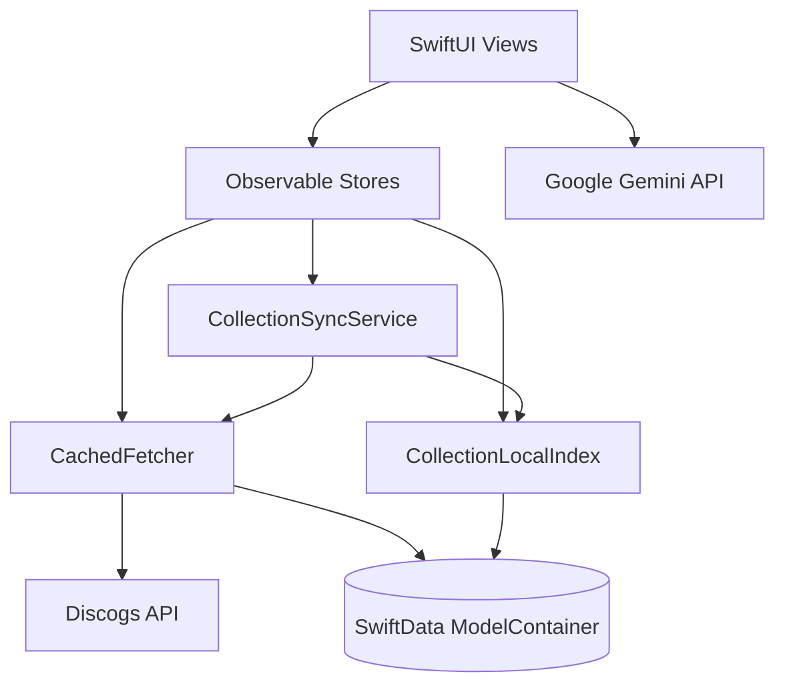

# DiscoScan Business Logic

Developer-facing documentation for how DiscoScan works internally. For product features and setup, see the root [README.md](../README.md).

## What this covers

These docs explain data flow, state management, caching, and sync — not UI styling or visual design.

| Topic | Document |
| ----- | -------- |
| Auth session and offline bootstrap | [auth.md](auth.md) |
| Stores, `ResourceState`, environment injection | [stores-and-state.md](stores-and-state.md) |
| API cache layer (`CachedFetcher`) | [caching.md](caching.md) |
| Collection sync, local index, and search | [collection-sync.md](collection-sync.md) |
| Release search (text, barcode, photo) | [release-search.md](release-search.md) |

## Suggested reading order

1. **[auth.md](auth.md)** — Session lifecycle drives store resets and cache clearing.
2. **[stores-and-state.md](stores-and-state.md)** — How views consume async data via stores and `ResourceState`.
3. **[caching.md](caching.md)** — How network responses are cached and reused.
4. **[collection-sync.md](collection-sync.md)** — The dual-path collection model (local index vs network folders).
5. **[release-search.md](release-search.md)** — Three search entry paths converging on `SearchStore`.

## System overview

Views bind directly to `@Observable` stores. Stores orchestrate fetches through `CachedFetcher` (Discogs API cache) or `CollectionLocalIndex` (offline collection index). Auth changes propagate through store `sync(with:)` methods and global cache invalidation on logout.

## Key source directories

| Directory | Role |
| --------- | ---- |
| `DiscoScan/Auth/` | OAuth, Keychain tokens, `AuthSession` |
| `DiscoScan/Data/` | `CachedFetcher`, collection sync, local index |
| `DiscoScan/Features/*/Store/` | Feature stores (`CollectionStore`, `SearchStore`, `ProfileStore`, …) |
| `DiscoScan/Networking/` | Typed Discogs endpoints, Gemini client |
| `DiscoScan/Views/AsyncState/` | `ResourceContainerView` and loading/error UI |
