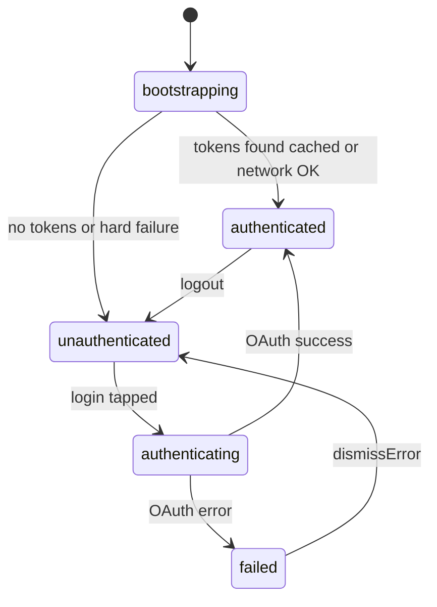
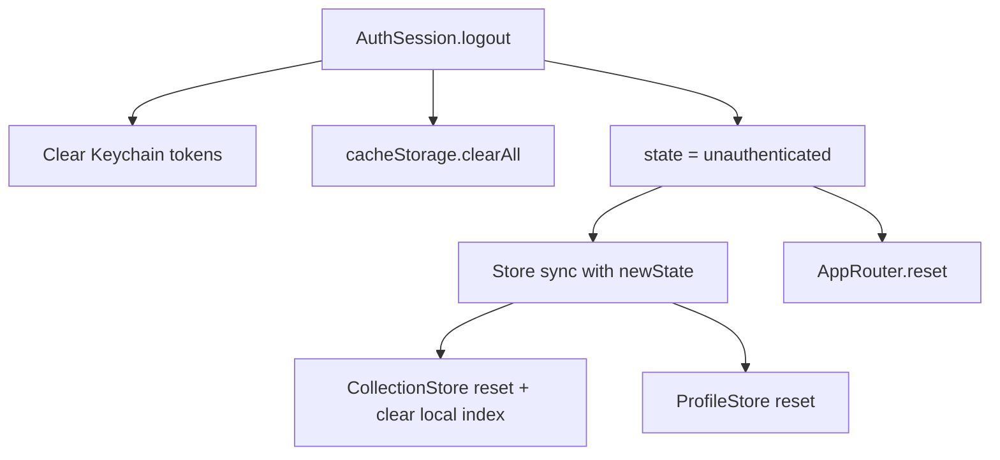

# Auth Session

`AuthSession` manages Discogs OAuth, token storage, and the authenticated user identity. Auth state drives store resets, cache clearing, and collection index lifecycle.

Primary file: [`AuthSession.swift`](../DiscoScan/Auth/AuthSession.swift)

## State machine



```swift
enum State: Equatable {
    case bootstrapping
    case unauthenticated
    case authenticating
    case authenticated(DiscogsIdentity)
    case failed(String)
}
```

[`RootView`](../DiscoScan/Features/Root/Views/RootView.swift) maps states to UI:

| State | Screen |
| ----- | ------ |
| `.bootstrapping` | `LoadingView` |
| `.unauthenticated`, `.failed` | `LoginView` |
| `.authenticating` | `LoadingView("Connecting to Discogs…")` |
| `.authenticated` | `MainTabView` |

## Bootstrap

Called once at app launch via `.task { await authSession.bootstrap() }` in `DiscoScanApp`.

1. Load tokens from Keychain via `TokenStore`.
2. If cached identity exists in SwiftData (`cachedValue` with key `"identity"`), set `.authenticated(cached)` immediately.
3. Fetch fresh identity from Discogs with `forceRefresh: true`.
4. On success, set `.authenticated(identity)`.

### Offline resilience

If network fetch fails but cached identity was already applied in step 2, bootstrap **keeps** `.authenticated`. This allows offline use after a prior successful login. Covered by [`AuthSessionOfflineTests.swift`](../DiscoScanTests/AuthSessionOfflineTests.swift).

### Failure handling

| Error | Result |
| ----- | ------ |
| `TokenStoreError.notFound` | `.unauthenticated` |
| HTTP 401 | Clear tokens → `.unauthenticated` |
| Network error with no cached identity | Clear tokens → `.unauthenticated` |
| Network error with cached identity | Stay `.authenticated` |

## Login

1. Set `.authenticating`.
2. Run `DiscogsOAuthService.performLogin()` (Safari OAuth flow).
3. Fetch identity with `forceRefresh: true`.
4. On success → `.authenticated(identity)`.
5. On failure → clear tokens → `.failed(message)`.

User dismisses the error via `dismissError()` → `.unauthenticated`.

## Logout cascade



`logout()` steps:

1. Clear Keychain tokens.
2. `cacheStorage.clearAll()` — wipes all `CachedRecord` API cache entries.
3. Set `.unauthenticated`.

Downstream effects:

- `DiscoScanApp.onChange(authSession.state)` calls `sync(with:)` on Collection, WantList, and Profile stores.
- `CollectionStore.sync` clears the local collection index for the prior user and resets in-memory state.
- `RootView.onChange` calls `router.reset()` — clears all tab navigation paths.

SearchStore is not explicitly reset; its in-memory results become stale but the underlying cache is cleared.

## Identity fetch and 401

`fetchIdentity()` uses `CachedFetcher` with scope `.identity` and `forceRefresh: true`. On HTTP 401:

- Clear tokens and cache
- Re-throw (bootstrap/login handle the state transition)

## App wiring

[`DiscoScanApp.swift`](../DiscoScan/DiscoScanApp.swift):

```swift
.onChange(of: authSession.state) { _, newState in
    collectionStore.sync(with: newState)
    wantListStore.sync(with: newState)
    profileStore.sync(with: newState)
    if case .authenticated = newState {
        Task { await collectionStore.ensureFolderZeroIndexReady() }
    }
}
```

On scene foreground (authenticated):

```swift
await collectionStore.repairFolderZeroIndexIfNeeded()
await collectionStore.syncFolderZeroIndex(forceRefresh: false)
```

## Token storage

OAuth tokens live in the Keychain via `TokenStoreProtocol`. Identity is cached separately in SwiftData under cache key `"identity"` with a 24-hour TTL (see [caching.md](caching.md)).

## Related docs

- [stores-and-state.md](stores-and-state.md) — Store `sync(with:)` and reset behavior
- [caching.md](caching.md) — Cache clearing on logout
- [collection-sync.md](collection-sync.md) — Index cleared on user switch
