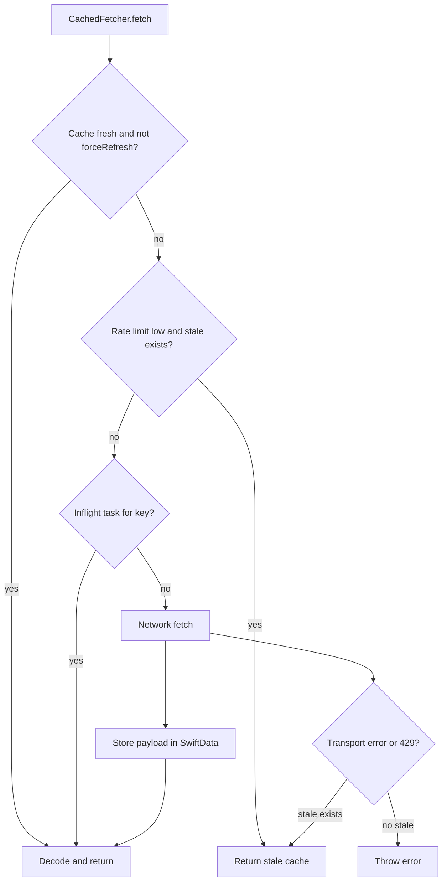

# Caching

DiscoScan caches Discogs API responses in SwiftData via the `CachedFetcher` actor. This is separate from the collection local index (see [collection-sync.md](collection-sync.md)) but both share one `ModelContainer`.

## Two persistence layers

| Layer | SwiftData model | Purpose |
| ----- | --------------- | ------- |
| **API cache** | `CachedRecord` | Raw JSON payloads keyed by string, TTL by `CacheScope` |
| **Collection index** | `LocalCollectionItem`, `CollectionSyncMetadata` | Denormalized "All" folder for offline search |

Primary files:

- [`CachedFetcher.swift`](../DiscoScan/Data/CachedFetcher.swift)
- [`CachePolicy.swift`](../DiscoScan/Data/CachePolicy.swift)
- [`SwiftDataCacheStorage.swift`](../DiscoScan/Data/SwiftDataCacheStorage.swift)

## Fetch decision tree

### Steps in order

1. **Fresh hit** — If `forceRefresh == false` and a cached entry exists within TTL, decode and return without network.
2. **Rate-limit throttle** — If `RateLimitTracker.shouldThrottle()` (remaining &lt; 5) and stale cache exists, return stale without network.
3. **Inflight deduplication** — Concurrent requests for the same key share one `Task`.
4. **Network fetch** — Call `apiClient.responseData`, store payload with `fetchedAt` timestamp.
5. **Offline fallback** — On `NetworkError.transportError` or HTTP 429, return stale cache if any; otherwise throw.

## Cache scopes and TTL

Defined in [`CachePolicy.swift`](../DiscoScan/Data/CachePolicy.swift):

| `CacheScope` | TTL | Typical use |
| ------------ | --- | ----------- |
| `.identity` | 24 hours | OAuth identity |
| `.profile` | 24 hours | User profile |
| `.search` | 15 minutes | Discogs search results |
| `.wantlist` | 1 hour | Want list pages |
| `.collection` | 1 hour | Folder list and per-folder release pages |
| `.release` | 7 days | Release detail |

Freshness is computed at fetch time: `now - fetchedAt < scope.ttl`. The scope passed to `fetch` determines TTL even though scope is also stored on the record.

## Cache keys

Keys are caller-defined strings. There is no central registry.

| Key pattern | Scope | Owner |
| ----------- | ----- | ----- |
| `"identity"` | `.identity` | `AuthSession` |
| `"userProfile"` | `.profile` | `ProfileStore` |
| `"search-text-{query}"` | `.search` | `SearchContext` |
| `"search-barcode-{code}"` | `.search` | `SearchContext` |
| `"search-image-{query}"` | `.search` | `SearchContext` |
| `"collectionFolders"` | `.collection` | `CollectionStore`, `CollectionSyncService` |
| `"collectionFolder-{folderId}-page-{page}"` | `.collection` | `CollectionStore`, `CollectionSyncService` |

### Invalidation

| Method | When used |
| ------ | --------- |
| `invalidate(key:)` | Single key removal + cancel inflight task |
| `invalidateKeys(matchingPrefix:)` | Prefix purge (e.g. `"collectionFolder-1-page-"` before folder refresh) |

Stores call prefix invalidation on pull-to-refresh for paginated data, then refetch page 1 with `forceRefresh: true`.

### Special cases

- **Collection sync** always passes `forceRefresh: true` for folder-zero pages, bypassing TTL even within the 1-hour collection scope.
- **`cachedValue`** reads cache ignoring TTL — used at auth bootstrap to show cached identity immediately.

## Rate limiting

[`RateLimitTracker`](../DiscoScan/Networking/Utils/RateLimitTracker.swift) reads Discogs rate-limit headers. When remaining requests drop below 5, `CachedFetcher` prefers stale cache over new network calls. HTTP 429 marks the limit as exhausted and also falls back to stale cache when available.

## Logout and cache clearing

[`AuthSession.logout()`](../DiscoScan/Auth/AuthSession.swift) calls `cacheStorage.clearAll()`, wiping all `CachedRecord` entries. User-scoped stores reset in-memory state via `sync(with:)`. The collection local index is cleared separately by `CollectionStore` on logout or user switch.

See [auth.md](auth.md) for the full logout cascade.

## Related docs

- [stores-and-state.md](stores-and-state.md) — How stores call `CachedFetcher`
- [collection-sync.md](collection-sync.md) — Local index (separate from API cache)
- [release-search.md](release-search.md) — Search cache keys and 15-minute TTL
