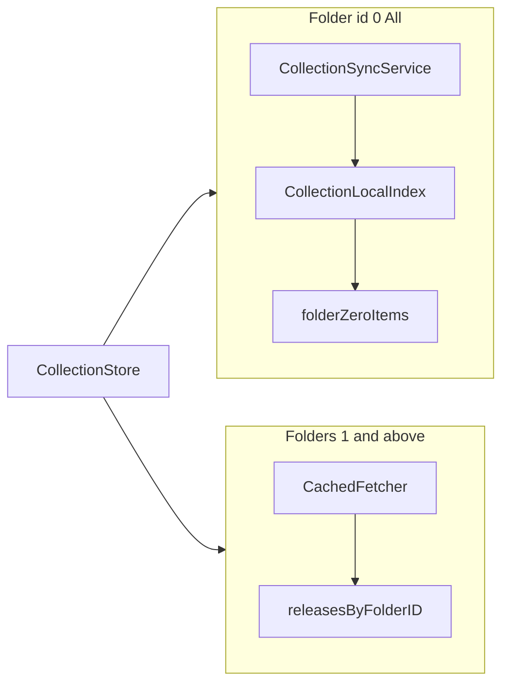
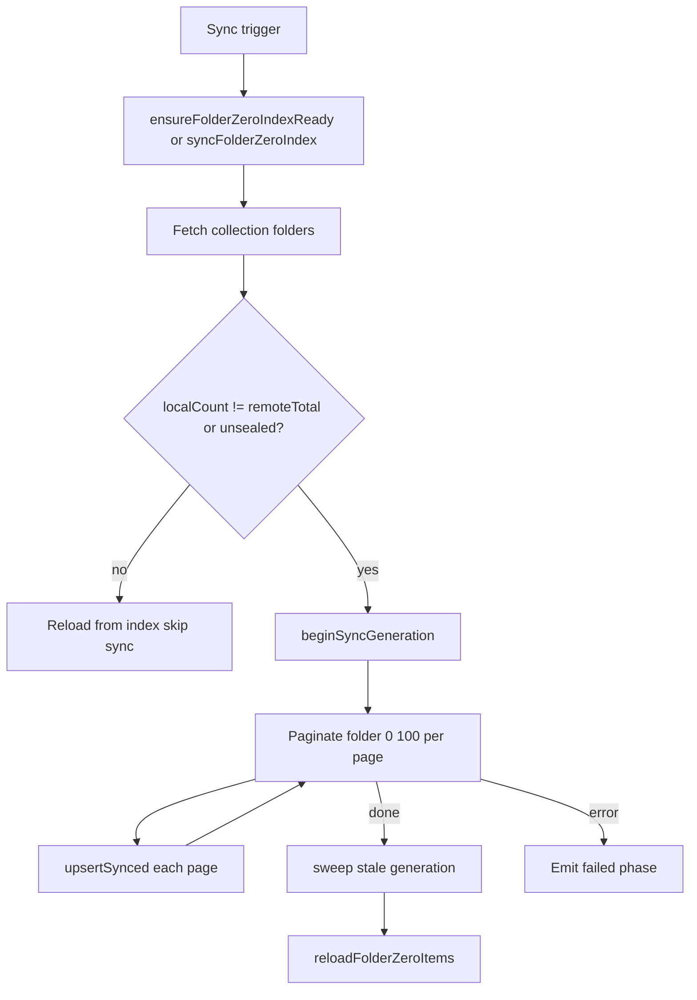

# Collection Sync and Local Search

The Discogs "All" folder (folder id `0`) is served from a local SwiftData index. Other folders load paginated releases from the Discogs API. Both paths are orchestrated by `CollectionStore`.

## Dual data paths



| Folder | Source | Pagination | Offline |
| ------ | ------ | ---------- | ------- |
| `.zero` ("All") | `CollectionLocalIndex` | All items loaded from index | Yes, after sync |
| 1+ | Discogs API via `CachedFetcher` | 50 per page, infinite scroll | No (cached pages only) |

Primary files:

- [`CollectionSyncService.swift`](../DiscoScan/Data/CollectionSyncService.swift)
- [`CollectionLocalIndex.swift`](../DiscoScan/Data/CollectionLocalIndex.swift)
- [`LocalCollectionItem.swift`](../DiscoScan/Data/LocalCollectionItem.swift)
- [`CollectionStore.swift`](../DiscoScan/Features/Collection/Store/CollectionStore.swift)
- [`CollectionListView.swift`](../DiscoScan/Features/Collection/Views/CollectionListView.swift)

## Sync pipeline



### Sync triggers

| Trigger | Entry point |
| ------- | ----------- |
| Sign-in | `DiscoScanApp` → `ensureFolderZeroIndexReady()` |
| Open All folder | `CollectionListView.task` → `ensureFolderZeroIndexReady()` |
| Pull-to-refresh | `syncFolderZeroIndex(forceRefresh: true)` |
| App foreground | `repairFolderZeroIndexIfNeeded()` then `syncFolderZeroIndex(forceRefresh: false)` |
| Count mismatch | Local count ≠ remote All-folder count from folders API |
| Unsealed generation | Previous sync interrupted before sweep |

### Coalescing

`CollectionSyncService` holds one `inFlightRefresh` task. Concurrent sync requests await the same task and receive the final `CollectionSyncPhase`.

### Progress phases

```swift
enum CollectionSyncPhase {
    case idle
    case checking
    case syncing(synced: Int, total: Int)
    case failed(String)
}
```

`CollectionStore` maps these to UI via `CollectionSyncBanner`. On `.checking`, `folderZeroItems` enters refresh. Terminal `.idle` reloads items; `.failed` surfaces an error with Retry.

### Error cases

| Error | Cause |
| ----- | ----- |
| `allFolderNotFound` | Folders response missing id `0` |
| `paginationFailed(page:message:)` | Network failure on a sync page |
| `indexWriteFailed(message:)` | SwiftData write failure during upsert |

## Mark-and-sweep generations

Sync uses a generation counter in `CollectionSyncMetadata` per username:

```
beginSyncGeneration:
  if activeGeneration == sealedGeneration:
    activeGeneration += 1

upsertSynced(items, generation):
  upsert each item with syncGeneration = generation

upsertLive(item) / delete(instanceId):
  upsert or remove using meta.activeGeneration

sweep(keeping: generation):
  DELETE items WHERE syncGeneration < generation
  sealedGeneration = generation
  update localCount and lastSyncedAt
```

**Why generations matter:**

- An interrupted sync leaves `activeGeneration > sealedGeneration` (`hasUnsealedGeneration`), forcing a retry even if counts match.
- Live mutations during sync tag rows with `activeGeneration`, so they survive the sweep.
- Remote removals are handled by sweep: items not re-upserted in the new generation are deleted.

## LocalCollectionItem

Each synced release becomes a denormalized SwiftData row keyed by `instanceId`:

| Field | Source |
| ----- | ------ |
| `instanceId`, `releaseId`, `folderId`, `dateAdded` | Discogs collection item |
| `artistName`, `title`, `labelName`, `catno`, `year` | Release basic information |
| `searchableText` | Lowercased join of artist, title, label, catno, year |
| `syncGeneration` | Current sync generation tag |

Upsert by `instanceId`: existing rows update in place; new instance ids insert.

### Display order

[`CollectionLocalIndex.fetchDescriptor`](../DiscoScan/Data/CollectionLocalIndex.swift) sorts by `dateAdded` descending (newest first). Sync fetches pages with default API sort (artist ascending), but display order comes from the local fetch descriptor.

## Local search

Search applies only to folder `.zero` in [`CollectionListView`](../DiscoScan/Features/Collection/Views/CollectionListView.swift) via `.searchable`.

### Searchable text

Built in `LocalCollectionItem.makeSearchableText`:

```
[artist, title, label, catno, year?.description ?? ""]
  .joined(separator: " ")
  .lowercased()
```

### Matching algorithm

`CollectionSearchMatching.matches(query:searchableText:)`:

1. Trim and lowercase the query.
2. Split on whitespace into tokens.
3. Empty query matches all items.
4. Every token must appear as a substring in `searchableText` (order-independent).

No fuzzy matching, stemming, or word boundaries.

### Two code paths

| Path | Location | Used by |
| ---- | -------- | ------- |
| `CollectionStore.searchFolderZero(query:)` | MainActor, in-memory filter on `folderZeroItems.value` | UI |
| `CollectionLocalIndex.search(username:query:)` | Index actor, fetch all then filter | Available for async use |

Both use the same text construction and matching logic. Search preserves the underlying sort order from the index.

## Mutations

Add and delete keep the local index, in-memory folder lists, and folder counts in sync:

**Add release:**

1. Discogs API add
2. `localIndex.upsertLive(item)`
3. Prepend to `releasesByFolderID[folderId]` if loaded
4. `reloadFolderZeroItems()`
5. Refresh folder counts

**Delete release:**

1. Discogs API delete
2. `localIndex.delete(instanceId:)`
3. Filter item from `releasesByFolderID[folderId]`
4. `reloadFolderZeroItems()`
5. Refresh folder counts

## Loading semantics

When local count is zero but remote All-folder count is greater than zero, `folderZeroItems` stays in `.loading` (not `.loaded([])`) until sync completes. This avoids showing an empty list while sync is pending.

## Related docs

- [stores-and-state.md](stores-and-state.md) — `ResourceState` and `CollectionSyncPhase`
- [caching.md](caching.md) — API cache for folder 1+ and sync pagination
- [auth.md](auth.md) — Index cleared on logout or user switch
