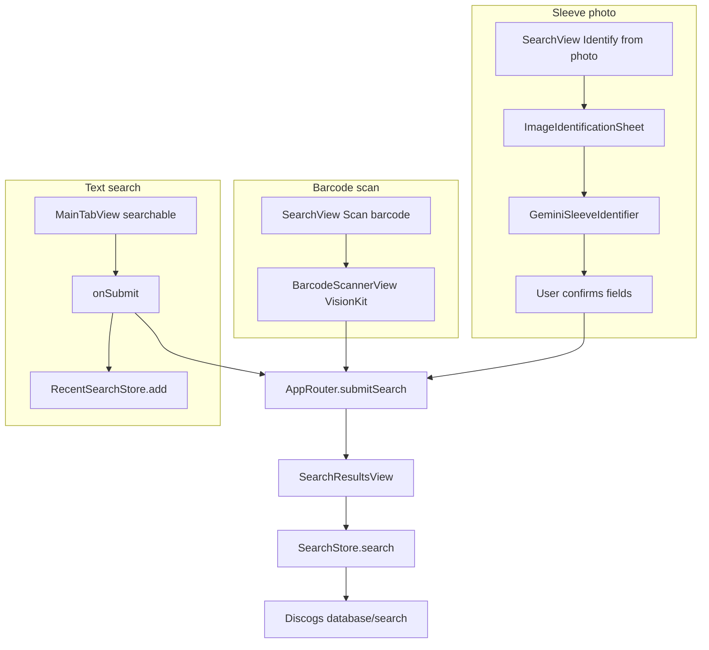

# Release Search

Release search unifies three entry paths — text, barcode, and sleeve photo — through `SearchContext` and `SearchStore`, all targeting Discogs `GET database/search`.

## Entry paths



## SearchContext

Defined in [`SearchContext.swift`](../DiscoScan/Models/Search/SearchContext.swift):

```swift
enum SearchContext: Hashable, Sendable {
    case text(query: String)
    case barcode(code: String)
    case imageSuggested(query: String)
}
```

Each case maps to an endpoint, cache key, and navigation title:

| Context | Discogs query | Cache key prefix |
| ------- | ------------- | ---------------- |
| `.text(query:)` | `?q=…&type=release` | `search-text-` |
| `.barcode(code:)` | `?barcode=…&type=release` | `search-barcode-` |
| `.imageSuggested(query:)` | Same as text (`?q=…`) | `search-image-` |

`imageSuggested` uses the same text endpoint as manual search but gets a separate cache key and "Photo Matches" navigation title.

## Text search

1. User types in the system search field on [`MainTabView`](../DiscoScan/Features/Root/Views/MainTabView.swift).
2. Search fires **on submit only** — `.onSubmit(of: .search)` calls `submitTextSearch()`.
3. Empty queries are ignored.
4. `RecentSearchStore.add(query)` persists to UserDefaults (max 10, case-insensitive dedup).
5. `AppRouter.submitSearch(.text(query:))` switches to the search tab and pushes `AppRoute.searchResults(context:)`.
6. [`SearchResultsView`](../DiscoScan/Features/Search/Views/SearchResultsView.swift) runs `.task { await searchStore.search(context) }`.

**Recent search replay:** Tapping a recent item in `SearchView` or a search suggestion also routes via `submitSearch(.text(query:))`. Suggestions populate the field but do not search until submit.

There is **no live-as-you-type search** and **no query debouncing** — this avoids API spam and respects Discogs rate limits.

## Barcode scan

1. [`SearchView`](../DiscoScan/Features/Search/Views/SearchView.swift) presents `BarcodeScannerView` (VisionKit, EAN-8/EAN-13/UPC-E).
2. First scan wins; haptic feedback; scanner stops.
3. `AppRouter.submitSearch(.barcode(code:))` → barcode endpoint.
4. **Auto-navigation:** If exactly one result has `type == "release"`, [`SearchResultsContent`](../DiscoScan/Features/Search/Views/SearchResultsContent.swift) auto-pushes release detail.

Barcode scans do **not** add to recent searches.

## Sleeve photo identification

1. `ImageIdentificationSheet` manages phases: capturing → analyzing → confirming.
2. Photo from library (`PhotosPicker`) or camera.
3. [`GeminiSleeveIdentifier`](../DiscoScan/Networking/Gemini/GeminiSleeveIdentifier.swift) sends a downscaled JPEG to Google Gemini and parses JSON `{ artist, title, catalogNumber }`.
4. User edits fields in the confirm step, then taps **Search Discogs**.
5. `SearchView` closes the sheet and calls `submitSearch(.imageSuggested(query:))`.

The composed query joins non-empty trimmed artist, title, and catalog number with spaces.

Photo searches do **not** add to recent searches.

## SearchStore

[`SearchStore.swift`](../DiscoScan/Features/Search/Store/SearchStore.swift):

| Behavior | Detail |
| -------- | ------ |
| State | `[SearchContext: ResourceState<SearchResponse>]` |
| Skip refetch | If already `.loaded` and `forceRefresh == false`, returns immediately |
| Fetch | `cachedFetcher.fetch(context.endpoint, key: context.cacheKey, scope: .search, …)` |
| Loading | `beginRefresh()` → `.loading` or `.refreshing(stale)` |
| Failure | `recoverFromFetchFailure` — refresh failure preserves stale results |

SearchStore is not auth-scoped. Logout clears cached search results via global `cacheStorage.clearAll()`.

## Caching

- Scope: `.search`
- TTL: 15 minutes
- Keys: `search-text-{query}`, `search-barcode-{code}`, `search-image-{query}`

See [caching.md](caching.md) for fetch decision tree and offline fallback.

## SearchEndpoint

[`SearchEndpoint.swift`](../DiscoScan/Networking/Endpoints/Search/SearchEndpoint.swift):

- Path: `database/search`
- Shared params: `type=release`, `page=1`, `per_page=25`
- Text mode: `q` query parameter
- Barcode mode: `barcode` query parameter

The endpoint supports pagination parameters but the UI only requests page 1.

## RecentSearchStore

[`RecentSearchStore.swift`](../DiscoScan/Data/RecentSearchStore.swift):

- UserDefaults key: `"recentSearches"`
- Limit: 10 entries
- `add`: trim, dedupe case-insensitively, prepend
- `remove`, `clearAll`
- Only text submit (`MainTabView.submitTextSearch`) writes recents

## Error and empty states

| Situation | UI treatment |
| --------- | ------------ |
| Network failure | `ResourceState.failed` → `ErrorView` with retry |
| Refresh failure with stale data | Reverts to `.loaded(stale)` — no error screen |
| Loaded with zero results | Empty state: "No releases matched this search." |
| Gemini failure | Footnote error in capture view; user can retry or fall back to barcode |
| Scanner unavailable | `ContentUnavailableView` |

## Intentional limits

- **No pagination in UI** — only page 1 is fetched despite endpoint support.
- **No live search** — submit-based model protects against rate limiting.
- **Separate cache keys per context type** — same query string from text vs photo gets independent cache entries.

## Related docs

- [stores-and-state.md](stores-and-state.md) — `ResourceState` and view integration
- [caching.md](caching.md) — Search cache TTL and keys
