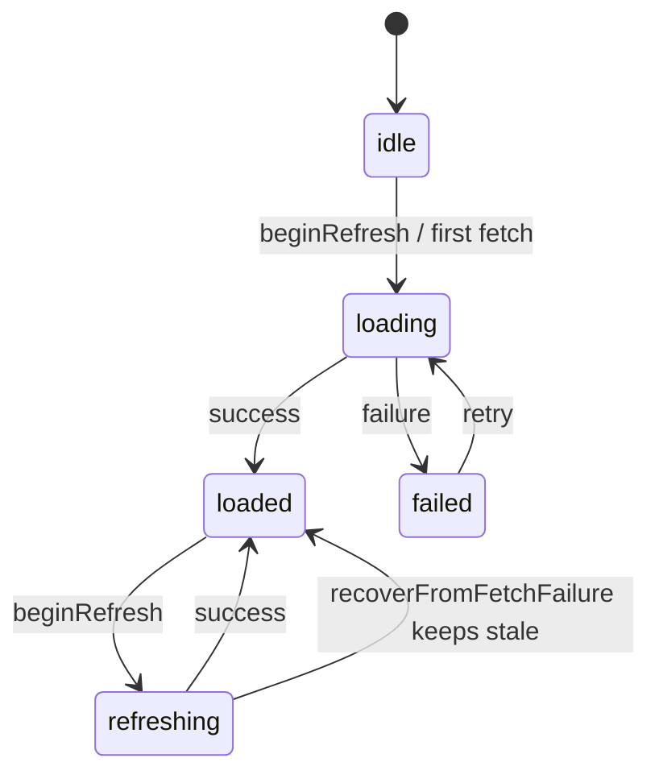

# Stores and State

DiscoScan uses an MV pattern: `@MainActor @Observable` stores are aggregate roots; SwiftUI views bind directly with no per-screen ViewModels.

## Store inventory

| Store | Auth-scoped | Primary state | Data source |
| ----- | ----------- | ------------- | ----------- |
| `CollectionStore` | Yes | `folders`, `releasesByFolderID`, `folderZeroItems`, `folderZeroSync` | CachedFetcher + local index |
| `SearchStore` | No | `resultsByContext` | CachedFetcher |
| `ProfileStore` | Yes | `profile` | CachedFetcher |
| `AuthSession` | — | `state` | OAuth + CachedFetcher |

Other stores (`WantListStore`, `ReleaseStore`) follow the same `ResourceState` patterns but are outside the scope of this documentation set.

## ResourceState

Defined in [`CollectionStoreProtocol.swift`](../DiscoScan/Features/Collection/Store/CollectionStoreProtocol.swift):

```swift
enum ResourceState<T: Equatable & Sendable>: Equatable, Sendable {
    case idle
    case loading
    case refreshing(T)
    case loaded(T)
    case failed(String)
}
```

### Transitions



| Helper | Behavior |
| ------ | -------- |
| `value` | Returns `T?` from `.loaded` or `.refreshing` |
| `beginRefresh()` | `.loaded`/`.refreshing` → `.refreshing(stale)`; otherwise → `.loading` |
| `recoverFromFetchFailure(_:)` | `.refreshing` → `.loaded(stale)` (stale data preserved); `.idle`/`.loading` → `.failed`; `.loaded` unchanged |

This gives **stale-while-revalidate** semantics: a refresh failure keeps the previous data on screen instead of replacing it with an error.

### CollectionSyncPhase (parallel track)

Folder-zero background sync uses a separate enum, not `ResourceState`:

```swift
enum CollectionSyncPhase: Equatable, Sendable {
    case idle
    case checking
    case syncing(synced: Int, total: Int)
    case failed(String)
}
```

`CollectionStore` subscribes to `CollectionSyncService.progressStream()` and maps `.checking` to `folderZeroItems.beginRefresh()`. The sync banner reads `folderZeroSync` directly. See [collection-sync.md](collection-sync.md).

## Canonical view pattern

Screens that load async data follow this shape:

```swift
ResourceContainerView(
    state: store.someProperty,
    retry: { await store.loadSomething(forceRefresh: true) }
) { data in
    // content using data
}
.task {
    if store.someProperty == .idle {
        await store.loadSomething()
    }
}
.refreshable {
    await store.loadSomething(forceRefresh: true)
}
```

[`ResourceContainerView`](../DiscoScan/Views/AsyncState/ResourceContainerView.swift) delays showing a spinner for 1.5 seconds on `.idle`/`.loading` to avoid flash on fast loads. It renders content for both `.loaded` and `.refreshing` so stale data stays visible during refresh.

## Auth-driven sync and reset

User-scoped stores implement `sync(with: AuthSession.State)`:

| Auth state | Behavior |
| ---------- | -------- |
| `.authenticated(identity)` | If username changed → reset and set new username. Same user → no-op. |
| Everything else | Reset in-memory state |

**CollectionStore** additionally clears the local SwiftData collection index when the user logs out or switches accounts.

**SearchStore** is intentionally **not** reset on auth change. Search results are keyed by query context; logout clears the API cache globally via `AuthSession.logout()` → `cacheStorage.clearAll()`.

### App wiring

[`DiscoScanApp.swift`](../DiscoScan/DiscoScanApp.swift) creates store instances once and reacts to auth:

```swift
.onChange(of: authSession.state) { _, newState in
    collectionStore.sync(with: newState)
    wantListStore.sync(with: newState)
    profileStore.sync(with: newState)
    if case .authenticated = newState {
        Task { await collectionStore.ensureFolderZeroIndexReady() }
    }
}
```

On app foreground (authenticated):

```swift
await collectionStore.repairFolderZeroIndexIfNeeded()
await collectionStore.syncFolderZeroIndex(forceRefresh: false)
```

See [auth.md](auth.md) for the full session lifecycle.

## Environment injection

Two styles coexist:

```swift
// Direct @Observable injection
.environment(authSession)
.environment(router)

// Protocol-typed custom EnvironmentValues keys
.environment(\.collectionStore, collectionStore)
.environment(\.cachedFetcher, cachedFetcher)
```

Views consume stores via protocol-typed environment keys:

```swift
@Environment(\.collectionStore) private var store
@Environment(AuthSession.self) private var authSession
```

Each `*StoreEnvironment.swift` file defines an `Unimplemented*Store` stub (fatalError if not injected) and an `@Entry` default. Previews inject mock implementations.

## Composition root

[`AppDependencies.make()`](../DiscoScan/App/AppDependencies.swift) wires concrete implementations:

- One shared SwiftData `ModelContainer` for API cache records and collection index models
- `CachedFetcher` actor over `SwiftDataCacheStorage`
- `CollectionLocalIndex` and `CollectionSyncService` actors
- Protocol-typed stores injected at the root in `DiscoScanApp.init()`

Stores depend on protocols (`CachedFetcherProtocol`, `CollectionLocalIndexProtocol`, …); views depend on store protocols (`CollectionStoreProtocol`, …).

## Mutation pattern

Collection mutations use `performMutation` in `CollectionStore`:

- Sets `isMutating = true` for the duration
- Captures errors in `lastMutationError` instead of throwing to views
- Updates local index, in-memory folder lists, and folder counts on success

## Related docs

- [auth.md](auth.md) — Bootstrap, logout, and offline auth
- [caching.md](caching.md) — How stores fetch through `CachedFetcher`
- [collection-sync.md](collection-sync.md) — Folder-zero sync and local index
